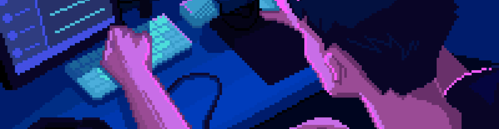

<!--Banner-->

# Hi, I'm Rishi4227! 👋
🎓 Computer Science Student | 🌟 Passionate about AI and Web Development

## 🛠️ Skills
- Programming: Python, JavaScript, Kotlin
- Frameworks: React, Django
- AI/ML: TensorFlow, PyTorch
- Other: Git, Docker, REST APIs

## 🔥 My Projects
- **[Twitter Sentiment Analysis](#)**: Real-time analysis of Twitter sentiments.
- **[Face API JS Project](#)**: An app using face recognition API.
- **[EuroConnect Telecom App](#)**: A management app for telecom operations.

## 🌐 Find me on
- [Portfolio](#) (Add your portfolio link here)
- [LinkedIn](#) (Add your LinkedIn profile link here)
- [Blog](#) (If applicable, add your blog link)

<!--Contact Section--> 

<h2 align="center">🤝 Connect with Me 🤝</h2>

  

 

  

